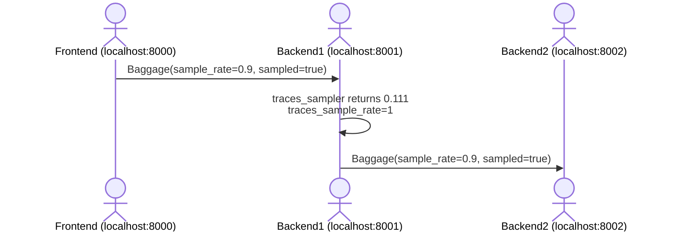
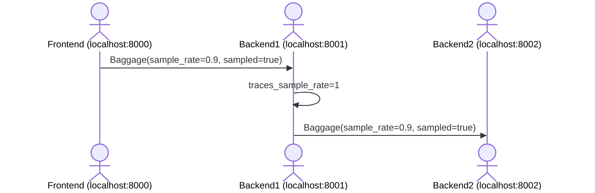

# Example setup for testing distributed tracing with Sentry

A simple example setup for testing distributed tracing with Sentry. Just call `./run.sh` to start the frontend and backend servers.

## Explicit sampling decision (in Backend1 start_transaction(sampled=True))

## Using `traces_sampler` (in Backend1)

## Using `traces_sample_rate` (in Backend1)

